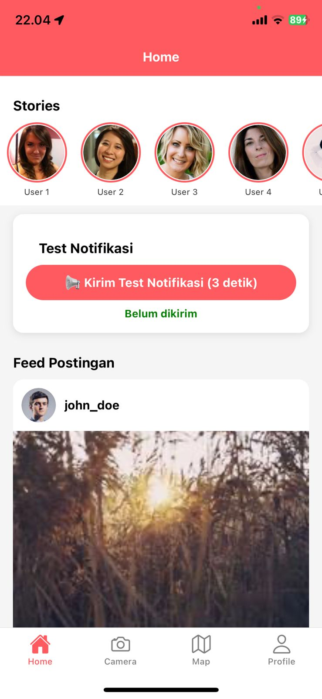
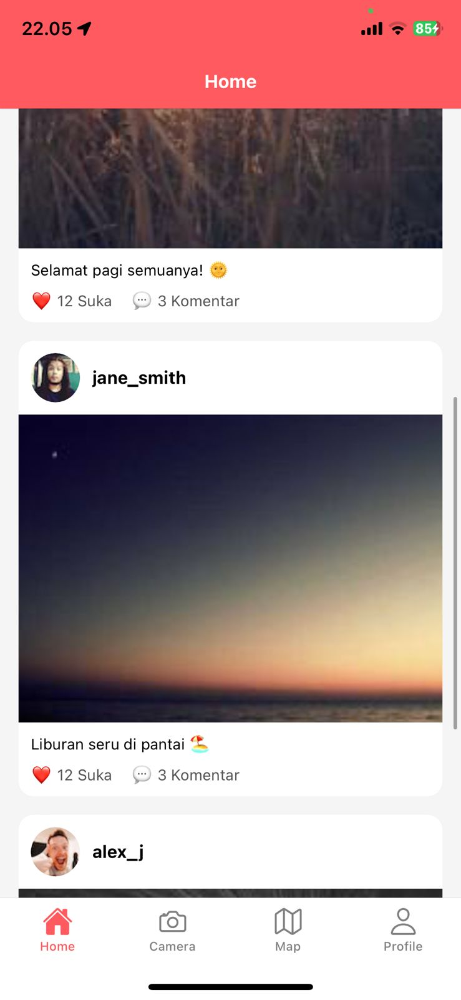
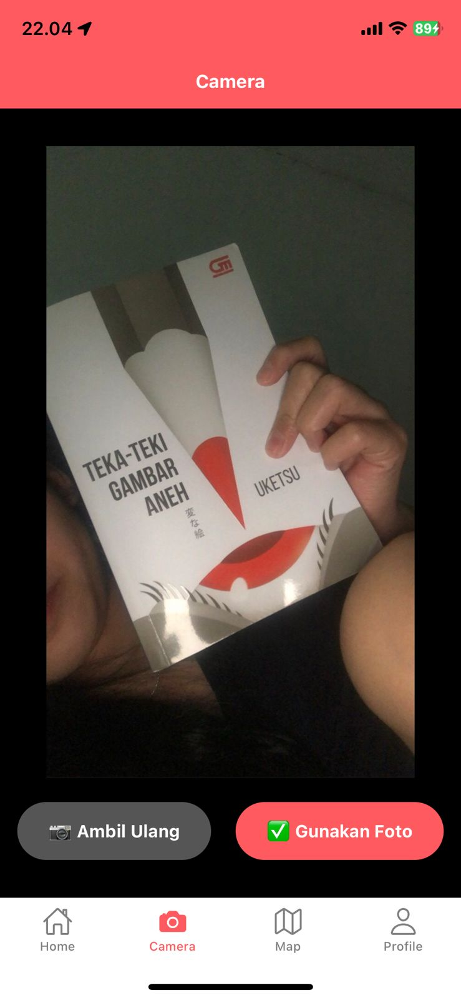
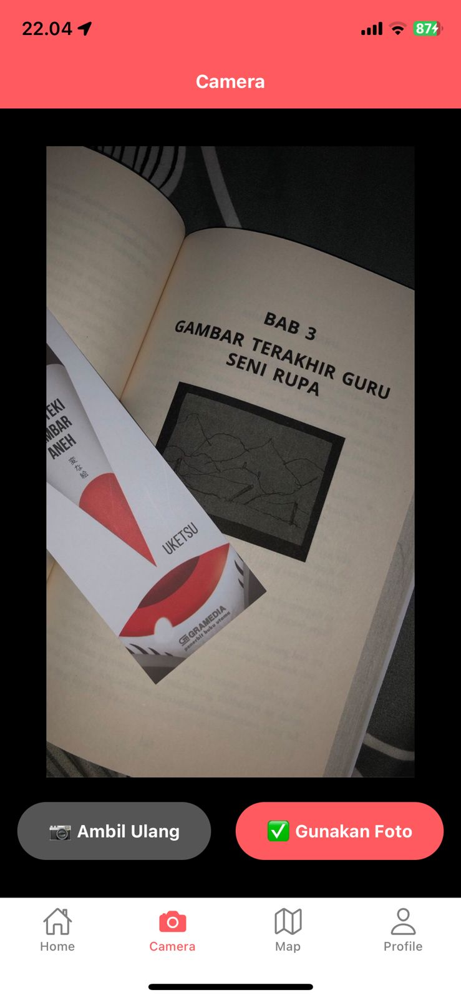
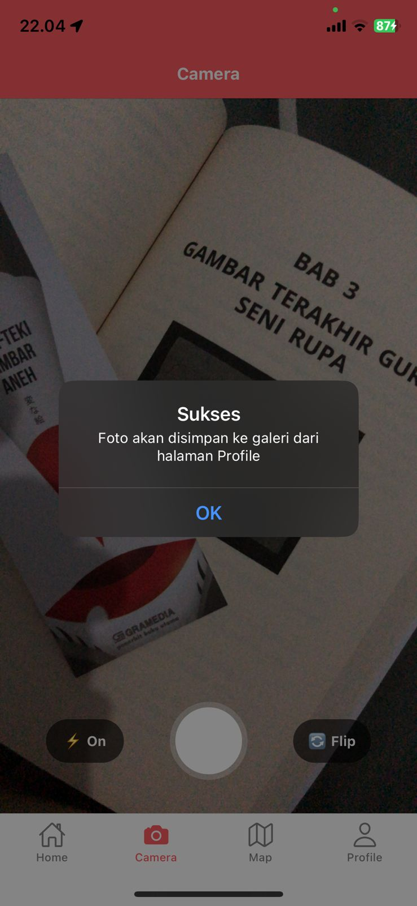
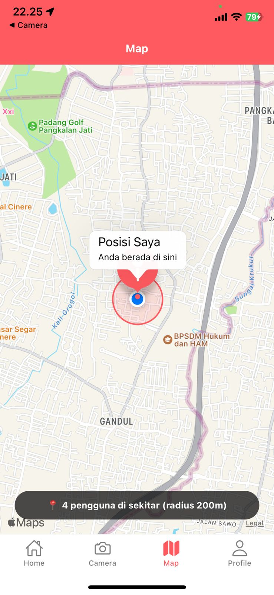
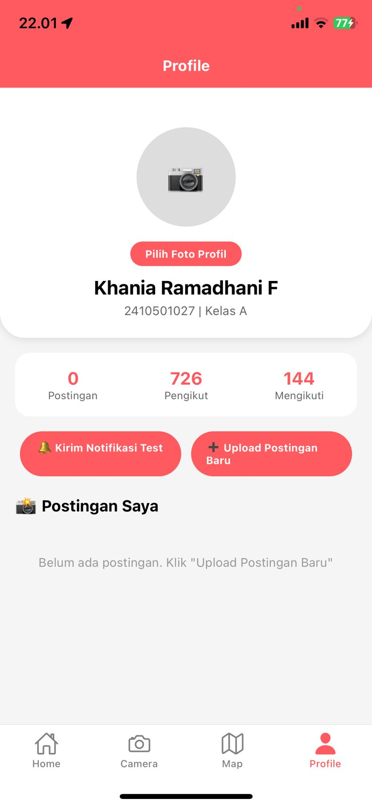
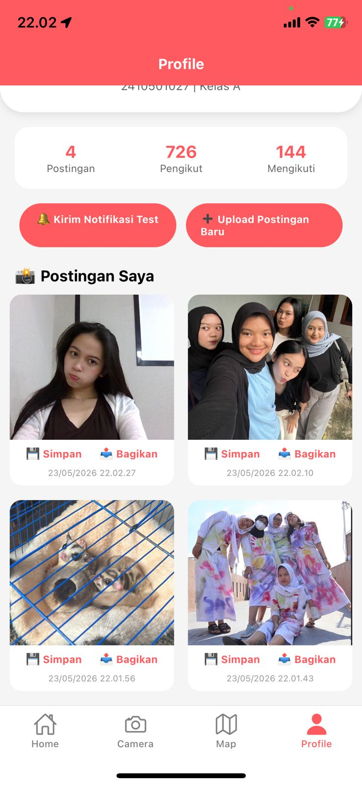
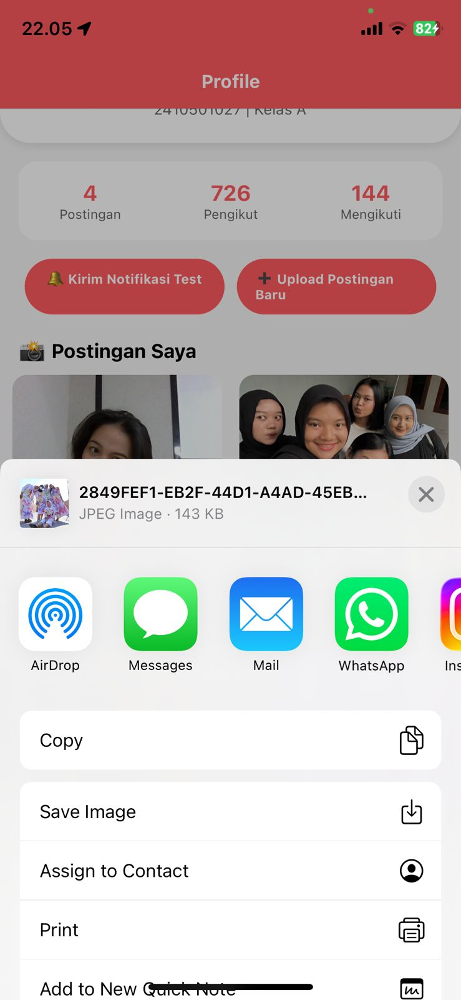

Nama : Khania Ramadhani Fitri
NIM  : 2410501027
Kelas: B

# SocialApp - Aplikasi Sosial Media (Tugas Mobile Lanjut)
Ini adalah aplikasi sosial media sederhana yang saya buat untuk memenuhi 
tugas Praktikum Pemrograman Mobile Lanjut. Aplikasi ini dibuat menggunakan
React Native (Expo) dan mengimplementasikan berbagai API native seperti kamera,
GPS, peta, notifikasi, file system, dan lain-lain. Seluruh kode ditulis dalam 
JavaScript murni (tanpa TypeScript) karena template awal yang dipakai adalah
blank template dari Expo.

# Screenshoot hasil

